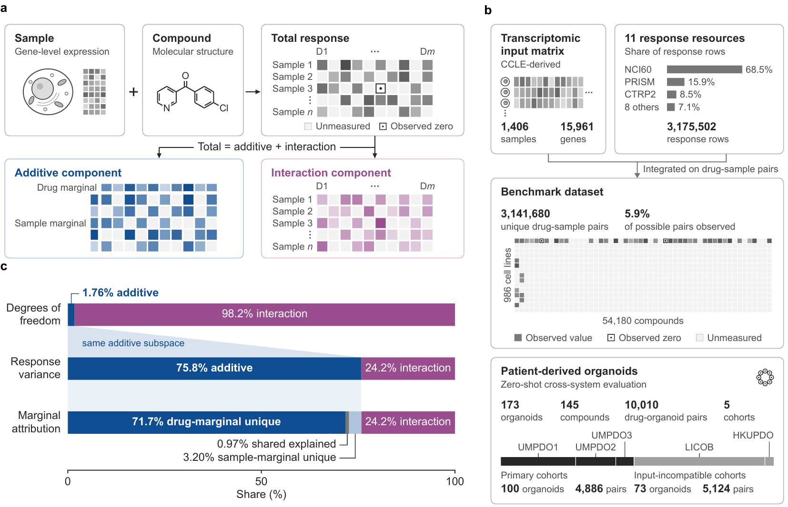

<a id="top"></a>

<div align="center">

<h1>DrugDis</h1>
<h3>解耦药物反应预测中的通用效应与情境特异性效应</h3>

<p>
  <a href="README.md">English</a> · <b>简体中文</b>
</p>

<p>
  
  <a href="pyproject.toml"></a>
  <a href="LICENSE"></a>
  <a href="manuscript/DrugDis_manuscript.pdf"></a>
  <a href="https://huggingface.co/datasets/Boom5426/DrugDis"></a>
  <a href="https://boom5426.github.io/DrugDis/"></a>
</p>

<p><strong>区分通用响应趋势与情境特异性的药物–样本效应。</strong></p>

<p>
  <a href="https://boom5426.github.io/DrugDis/">🌐 项目主页</a> ·
  <a href="#quick-start">🚀 快速开始</a> ·
  <a href="https://huggingface.co/datasets/Boom5426/DrugDis">🤗 数据</a> ·
  <a href="#reproduce">🧪 复现实验</a> ·
  <a href="manuscript/DrugDis_manuscript.pdf">📄 论文</a> ·
  <a href="CITATION.cff">📚 引用</a>
</p>

</div>

**DrugDis** 是一个用于解释药物反应预测的分量化评估框架。它在相同的已观测药物–样本对上，将实测响应和预测响应分解为 **加性效应**（跨药物与跨样本的总体趋势）和 **药物–样本交互效应**，并分别评估各分量的恢复程度、交互幅度和预测误差。

<table align="center" width="100%">
  <tr>
    <td align="center" width="25%"><h3>3,141,680</h3></td>
    <td align="center" width="25%"><h3>986</h3></td>
    <td align="center" width="25%"><h3>54,180</h3></td>
    <td align="center" width="25%"><h3>11</h3></td>
  </tr>
  <tr>
    <td align="center"><sub>药物–样本对</sub></td>
    <td align="center"><sub>癌细胞系</sub></td>
    <td align="center"><sub>化合物</sub></td>
    <td align="center"><sub>药物反应资源</sub></td>
  </tr>
</table>

<p align="center">
  <a href="assets/fig1.pdf"></a>
  <br>
  <sub>DrugDis 框架概览 · Figure 1 · <a href="assets/fig1.pdf">打开矢量图 ↗</a></sub>
</p>

### ✨ 为什么需要 DrugDis？

较高的总体预测分数，可能主要来自药物和样本的通用趋势，而不代表模型真正恢复了情境特异性的药物–样本关系。在 314 万个药物–样本对中，加性效应解释了 **75.8%** 的响应方差（在五个最大的药物反应资源中分别为 **59–83%**）；在留出细胞系设置下，一个总体响应相关性达到 **0.86** 的模型，对交互成分的相关性仅为 **0.32**。DrugDis 用于判断模型性能究竟由哪类响应结构驱动，分析不同表征与分布偏移下结论如何变化，并检验分量层面的提升是否能够转化为独立测量结果上的改进。完整分析见[论文](manuscript/DrugDis_manuscript.pdf)。

<table>
  <tr>
    <td valign="top" width="33%">
      <b>🧮 分解响应结构</b><br><br>
      在实际观测的评估支持集上，将加性效应与药物–样本交互效应分离。<br><br>
      <a href="#decompose">响应分解 →</a>
    </td>
    <td valign="top" width="33%">
      <b>🎯 评估模型能力</b><br><br>
      分别比较总体、加性与交互成分的恢复，并分析交互幅度与精确误差归因。<br><br>
      <a href="#evaluate">分量化评估 →</a>
    </td>
    <td valign="top" width="33%">
      <b>🧬 探索基准</b><br><br>
      使用公开数据与结果表复现留出细胞系、留出化合物和零样本类器官分析。<br><br>
      <a href="#benchmark">基准数据 →</a>
    </td>
  </tr>
</table>

<a id="quick-start"></a>

## 🚀 快速开始

**Python 3.11+ · 响应分解和评估 API 仅依赖 NumPy、pandas 和 SciPy。** 无需下载数据即可运行仓库自带示例：

```bash
git clone https://github.com/Boom5426/DrugDis.git
cd DrugDis
python -m pip install -e .
python examples/decompose_demo.py
```

> [!NOTE]
> 示例会构造一个 **80 个化合物 × 120 个样本、其中 30% 药物–样本对被观测到的合成数据表**，并评估两个假想预测器。该示例用于检查软件接口，**其中的数值不是论文基准结果**。

<details>
<summary><b>环境配置与可选依赖</b></summary>

建议创建独立环境：

```bash
conda create -n drugdis python=3.11 && conda activate drugdis
python -m pip install -e .
```

| 工作流 | 安装命令 |
| :--- | :--- |
| 响应分解与评估 API | `python -m pip install -e .` |
| 复现论文（训练、表格构建、数据处理） | `python -m pip install -e ".[paper]"` 或 `pip install -r requirements.txt` |
| 测试 | `python -m pip install -e ".[dev]"` |

`paper` extra 固定了论文分析所使用的主要版本：NumPy 1.26.4、pandas 1.5.3、SciPy 1.15.1、scikit-learn 1.5.2、PyArrow 18.0.0、PyTorch 2.4.1（CUDA 11.8 build）和 RDKit 2023.09.4。请根据本机硬件选择合适的 PyTorch 构建版本。

</details>

<a id="use-drugdis"></a>

## 🧭 使用 DrugDis

<a id="decompose"></a>

### 🧮 分解你的药物反应数据

输入数据中，每一行对应一个已观测的药物–样本对：

```python
import pandas as pd
from drugdis.evaluate import decompose

frame = pd.read_parquet("responses.parquet")    # columns SMILES, Sample_ID, Sensitivity
additive, interaction, summary = decompose(frame)
print(f"additive {summary['share_additive_pct']:.1f}% · interaction {summary['share_interaction_pct']:.1f}%")
```

如果列名不同，可显式指定，例如 `decompose(frame, response="auc", drug="drug_id", sample="cell_line")`。同一药物–样本对存在重复测量时，需要先取平均。返回的 summary 还会报告支持集几何结构，包括连通分量数，以及加性子空间维度 `n_drugs + n_samples - components`。

> [!TIP]
> **这些分量由当前观测支持集定义。** 交互成分表示某个已测药物–样本对相对于该支持集上最佳加性拟合的偏离。改变化合物、样本或已观测的药物–样本对，分量本身也会变化，因此不应将它解释为脱离评估面板后仍固定不变的内在生物学交互量。

<a id="evaluate"></a>

### 🎯 评估预测结果

对于同一测试集上的实测响应和模型预测：

```python
from drugdis.evaluate import component_profile

scores = component_profile(test_frame, y="Sensitivity", yhat="prediction")
print(f"total {scores['rawPCC']:.3f} · additive {scores['sharedPCC']:.3f} · interaction {scores['intPCC']:.3f}")
```

实测响应和预测响应由同一个基于测试药物–样本对构建的算子进行分解。不同输出对应不同的预测问题：

| 输出 | 回答的问题 |
| :--- | :--- |
| **总体响应相关性** (`rawPCC`) | 预测是否整体跟随实测响应变化？ |
| **加性成分相关性** (`sharedPCC`) | 是否恢复了药物与样本的边际趋势？ |
| **交互成分相关性** (`intPCC`) | 是否恢复了哪些药物–样本对偏离加性拟合，以及偏离方向？ |
| **交互幅度与 R²** (`A_int`, `R2_interaction`) | 预测交互的幅度是否与实测交互一致？ |
| **加性与交互成分误差** (`E_shared`, `E_interaction`) | 总平方误差分别落在哪个响应子空间？二者精确相加得到总体误差 (`MSE_raw`)。 |

<details>
<summary><b>解释说明</b></summary>

分量相关性衡量方向，但对尺度不敏感；`A_int` 衡量尺度；`R2_interaction = 2·A_int·intPCC − A_int²` 将二者结合。每个模型都应在其自身测试集的药物–样本对上评估：由于分解依赖支持集，不同支持集上的分量不应直接视为同一量。若同一药物–样本对存在独立重复测量，则可以用各分量上的测量一致性（cross-assay reproducibility，表 T03）作为经验参照，反映测量本身能够复现多少结构；它不是模型性能的理论上限。详细定义见[论文 Methods](manuscript/DrugDis_manuscript.pdf)。

</details>

<a id="benchmark"></a>

## 🧬 基准数据与评估设置

**细胞系基准数据集**包含来自 11 个药物反应资源的 **3,141,680 个唯一药物–样本对**，覆盖 986 个癌细胞系与 54,180 个化合物。药物响应测量来自 DROMA；每个符合条件的细胞系均使用同一套 CCLE 来源的 15,961 基因表达谱。由于这些来源并不共享统一的 assay metric 或生物学方向，响应字段保留为来源中的 **DROMA Sensitivity**。

| 评估设置 | 样本 | 化合物 | 药物–样本对 | 用途 |
| :--- | ---: | ---: | ---: | :--- |
| **细胞系基准** | 986 个细胞系 | 54,180 | 3,141,680 | 留出细胞系与留出化合物的主要基准 |
| **主要零样本类器官集合** | 100 个类器官 | 78 | 4,886 | 使用 UMPDO1–3 的预设跨系统评估 |
| **全部类器官队列** | 173 个类器官 | 145 | 10,010 | 敏感性分析；LICOB 与 HKUPDO 输入不兼容，因此单独报告 |

类器官队列**不属于细胞系基准数据集**。它们只用于使用细胞系训练 checkpoint 的零样本跨系统评估，不进行类器官微调。UMPDO1 和 UMPDO2 满足全部三个预设输入兼容性标准；UMPDO3 是预先保留在主要集合中的 near-miss，其表达层面的兼容性标准仅差 0.005。LICOB 和 HKUPDO 未通过兼容性检查，因此单独报告。仓库为每个留出轴提供了 5 组预设 split manifests。匹配的 M0/M3/M4 比较使用全部 5 个随机种子；表征基准使用前 3 个。

**[浏览 Hugging Face 数据集 ↗](https://huggingface.co/datasets/Boom5426/DrugDis)** &nbsp;·&nbsp; [Split manifests](manifests/) &nbsp;·&nbsp; [基准定义](configs/substrate_config.frozen.json) &nbsp;·&nbsp; [结果表](results/tables/README.md)

GitHub 仓库提供代码、split manifests 和 canonical result tables。Hugging Face 托管处理后的输入数据，包括 DROMA 数据库、处理后的响应与样本表、CCLE 来源表达数据、ECFP4、11 种预训练分子表征以及 11 种预训练转录组表征。[dataset card](https://huggingface.co/datasets/Boom5426/DrugDis) 记录了发布文件及其构建方式。

<details>
<summary><b>下载数据集</b></summary>

```python
from huggingface_hub import snapshot_download

snapshot_download(
    repo_id="Boom5426/DrugDis",
    repo_type="dataset",
    local_dir="data_external/DrugDis",
)
```

所有分析脚本通过三个环境变量定位输入和输出（见 [`drugdis/paths.py`](drugdis/paths.py)）：

```bash
export DRUGDIS_DATA=$PWD/data_external/DrugDis   # dataset; required
export DRUGDIS_RUNS=$PWD/runs                    # training outputs (default ./runs)
export DRUGDIS_WORK=$PWD/work                    # analysis outputs and rebuilt tables (default ./work)
```

DROMA collection 归档于 [doi:10.5281/zenodo.18503188](https://doi.org/10.5281/zenodo.18503188)，其输入数据 provenance 见 [doi:10.5281/zenodo.17498421](https://doi.org/10.5281/zenodo.17498421)。

</details>

<a id="reproduce"></a>

## 🔁 复现论文

可根据需要选择不同层级的入口：

| 目标 | 入口 | 所需输入 |
| :--- | :--- | :--- |
| **体验软件接口** | [仓库示例](examples/decompose_demo.py) | 仅仓库 |
| **查看论文结果** | [结果表索引](results/tables/README.md) | 已提交的 canonical tables |
| **重新运行分析** | [启动脚本](scripts/) 与下方命令 | Hugging Face 数据集；训练需要 1 张 CUDA GPU |

运行仓库测试：

```bash
python -m pip install -e ".[paper,dev]"
pytest
```

<details>
<summary><b>论文级复现命令</b></summary>

```bash
# 1. Processed inputs (optional: the dataset already contains them)
python drugdis/data/build_processed_tables.py --out "$DRUGDIS_DATA"
python drugdis/data/build_gdsc_sensitivity.py --out "$DRUGDIS_DATA/gdsc_sensitivity_data.parquet"
python drugdis/data/encode_ecfp4.py --out "$DRUGDIS_DATA/Molecule_Embeddings/ECFP4_emb2048.pickle"
python drugdis/data/build_ccle_substrate.py
python drugdis/data/align_all_gene_reps.py

# 2. Benchmark dataset and split manifests
python drugdis/splits/verify_frozen.py            # inputs and manifests against recorded checksums
bash scripts/make_manifests.sh                    # rebuild the manifests into $DRUGDIS_WORK/manifests

# 3. Training (one M0 run takes about seven minutes on an RTX 4090)
bash scripts/train_m0_m4_lclo.sh                  # M0 and M4, held-out cell lines, 5 seeds
bash scripts/train_m0_m4_lso.sh                   # M0 and M4, held-out compounds, 5 seeds
bash scripts/train_m3.sh                          # M3, both regimes, 5 seeds
bash scripts/run_benchmark.sh                     # representation benchmark, 3 seeds
bash scripts/decoder_matrix.sh && bash scripts/decoder_penalty_sweep.sh && bash scripts/decoder_confirm.sh

# 4. Every canonical table, compared with results/tables by SHA-256
bash scripts/reproduce_tables.sh
```

基准数据集由 [`configs/substrate_config.frozen.json`](configs/substrate_config.frozen.json) 定义：若一个药物–样本对中的样本属于具有 CCLE 表达谱的细胞系、不属于被排除的 Tavor project，且对应化合物具有 ECFP4 fingerprint，则该药物–样本对符合纳入条件；同一药物–样本对的重复测量取平均。`build_processed_tables.py` 实现 Methods 中描述的 overlap rule。主要 M0/M3/M4 与表征基准实验采用论文报告的训练默认值（batch size 2,048、30 epochs、learning rate 1e-4、dropout 0.4、weight decay 1e-5），并使用 `best_valmse.pth`，即验证集总体预测误差最低的 epoch。decoder-dependence 分析采用论文指定的特征标准化方式，并分别为加性与双线性 decoder 使用验证集选择的正则化强度。[PROJECT_STRUCTURE.md](PROJECT_STRUCTURE.md) 说明了仓库结构以及代码名称与论文术语之间的对应关系。

</details>

<details>
<summary><b>当前版本的复现检查</b></summary>

以下检查于 2026-09-29 在分析服务器上完成，使用本版本代码、处理后的数据以及论文所报告的训练结果：

- **Split manifests。** `scripts/make_manifests.sh` 可逐字节重建全部 10 个 manifests；`verify_frozen.py` 通过 34/34 项 checksum 检查。
- **结果表。** `scripts/reproduce_tables.sh` 可逐字节重建 24 张 canonical tables 中的 23 张。T10 的所有数值完全一致；其中 `prediction_sha256` 列记录 gzip 预测导出的 SHA-256，而 gzip 会保存写入时间，因此重新导出后即使解压内容完全相同，也会产生新的 hash。若使用原始导出文件构建，T10 也能逐字节一致。数值一致性检查通过 57/57 项。
- **训练。** 对 M0、M4（留出细胞系，seed 3407）以及 M3（留出化合物，seed 3407）分别复现 1 个 epoch，所有记录量均与已报告运行的第一个 epoch 完全一致。未重新执行完整训练。
- **处理后的输入。** 数据脚本可以重建内容一致的所有 processed inputs，但有两个 NCI60 有机锡化合物的五价 `[Sn-]` SMILES 会被 RDKit 2023.09.4 拒绝（109 行响应、2 个 fingerprint）；这两个化合物均不在基准数据集中。
- **单元测试**通过。

</details>

> [!IMPORTANT]
> 本仓库提供论文定量结果所对应的代码、canonical derived tables、主文和 Supplementary Information。绘图代码、模型 checkpoint 与 prediction exports 不包含在当前发布中；上方概览图为论文 Figure 1 的静态摘录。

<a id="citation"></a>

## 📚 引用

本仓库对应论文 **[DrugDis: Disentangling general and context-specific effects in drug-response prediction](manuscript/DrugDis_manuscript.pdf)**（[Supplementary Information](manuscript/DrugDis_SI.pdf)）。如果你在研究中使用 DrugDis 或其基准数据集，请引用该论文；机器可读的引用信息见 [`CITATION.cff`](CITATION.cff)。

<details>
<summary><b>BibTeX</b></summary>

```bibtex
@article{Li2026DrugDis,
  title  = {DrugDis: Disentangling general and context-specific effects in drug-response prediction},
  author = {Li, Bo and Liu, Chengliang and Peng, Yuzhong and Zhang, Bob and Wang, Qing and
            Zeng, Pinxian and Li, Mengran and Huang, Shenghui and Deng, Chuxia and Zhang, Yang},
  year   = {2026}
}
```

</details>

**许可证与支持。** 代码基于 [MIT License](LICENSE) 发布；原始数据集继续遵循其各自的数据使用条款。如有问题或可复现的 bug，请在 GitHub [提交 issue](https://github.com/Boom5426/DrugDis/issues)。

---

<p align="center">
  <b>Separate the additive. Score the interaction.</b><br>
  <sub><a href="#top">返回顶部 ↑</a></sub>
</p>
